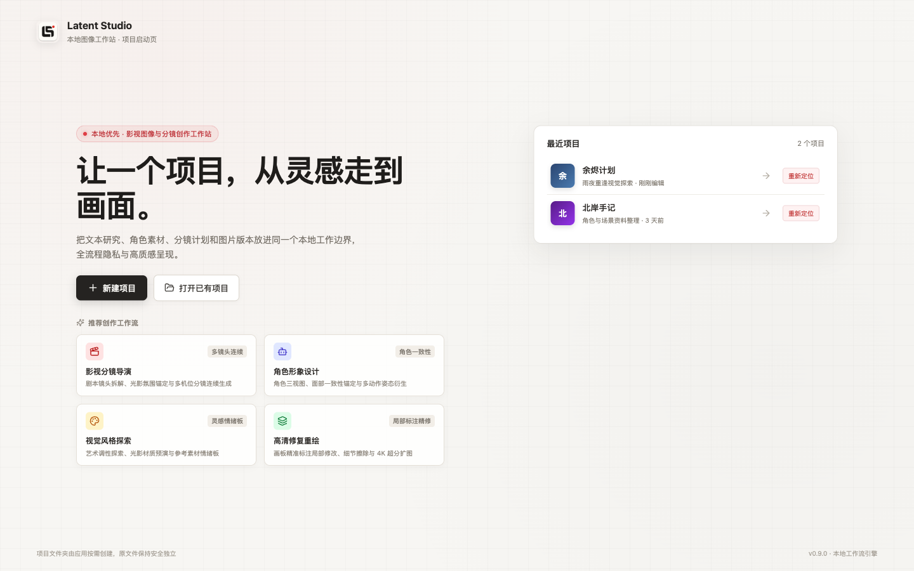
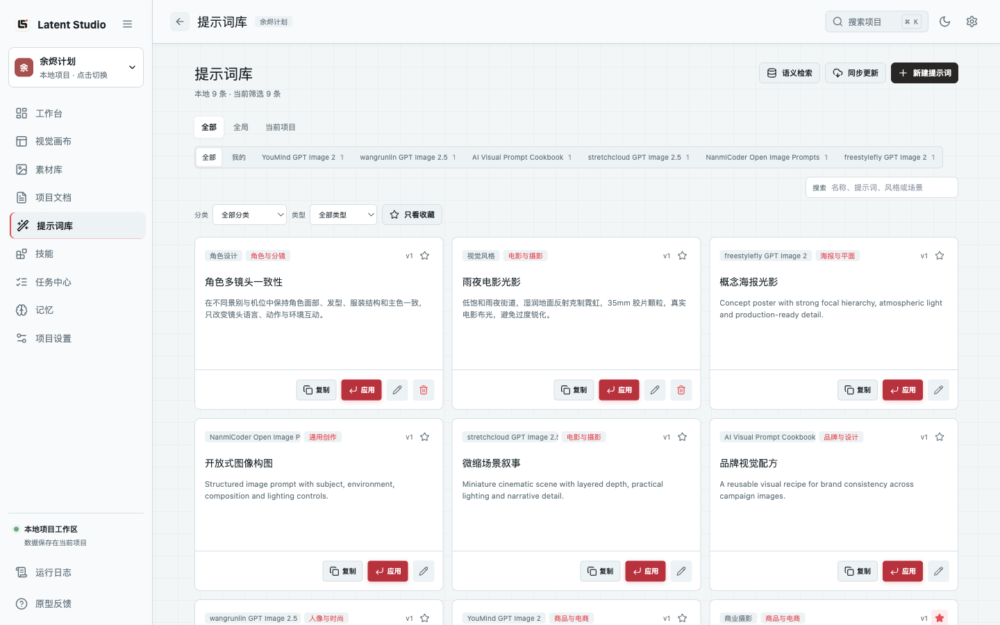

# Latent Studio

Latent Studio 是面向 macOS 的本地优先 AI 图像工作站。它把图片生成、文本对话、Agent 执行、提示词库、项目资料和图片版本放在同一个项目上下文中，适合需要持续积累视觉资产并反复迭代画面的个人创作者。

> 当前为源码预览版，尚未提供签名、公证的 macOS 安装包。使用真实模型前，需要在设置中配置自己的服务商连接和 API Key。

<p align="center">
  
</p>

_截图来自当前版本界面，使用隔离演示项目和演示数据，不包含个人提示词、API Key 或使用记录。_

## 核心能力：提示词库

Latent Studio 的提示词库不只是文本收藏夹。它把公开提示词源、个人提示词、项目模板和 Agent 检索连接成一条可持续复用的工作流。

<p align="center">
  
</p>

_图中的 9 条内容均为隔离演示数据；六个公开源各放入 1 条示例索引，用来展示当前界面的归档与筛选方式，不代表真实仓库条目总数。_

| 能力 | 当前实现 |
| --- | --- |
| 多源聚合 | 可同步 6 个正式公开源，并保留来源标识、原始链接、分类、分组、标签、中英文字段和远程预览地址 |
| 结构化本地索引 | 同步提示词结构化数据，不把公开仓库的全部样例图作为项目文件导入 |
| 增量同步 | 跳过未变化条目，更新发生变化的条目，并清理上游已删除的导入项；个人副本不受同步删除影响 |
| 个人与项目资产 | 支持提示词、参数化模板和风格片段，可存为全局或项目范围，并管理版本、收藏、分类、分组和标签 |
| 两级检索 | 默认使用本地关键词检索；可选安装本地嵌入模型进行语义检索，模型不可用时自动回退到关键词检索 |
| 直接进入创作 | 可复制或一键填入图片工作台；Agent 也能检索提示词库并读取完整提示词继续执行任务 |

当前桌面版本支持同步以下来源：

- [YouMind GPT Image 2](https://github.com/YouMind-OpenLab/awesome-gpt-image-2)
- [wangrunlin GPT Image 2.5](https://github.com/wangrunlin/awesome-gpt-image-2-5-prompts)
- [AI Visual Prompt Cookbook](https://github.com/VigoZhao/AI-Visual-Prompt-Cookbook)
- [stretchcloud GPT Image 2.5](https://github.com/stretchcloud/awesome-gpt-image-prompt-2.5)
- [NanmiCoder Open Image Prompts](https://github.com/NanmiCoder/open-image-prompts)
- [freestylefly GPT Image 2](https://github.com/freestylefly/awesome-gpt-image-2)

<p align="center">
  
</p>

_上图展示“一键应用”后的当前工作台。项目名、提示词和模型连接均为演示数据，截图未执行真实模型请求。_

## 主要功能

### 统一创作工作台

- **文本模式**：流式对话，读取项目文档和附件，支持模型原生搜索与受控 Skill。
- **图片模式**：单张生成、同提示词抽样、智能变体、分镜任务和独立创意。
- **Agent 模式**：先理解目标和项目上下文，再调用文档、记忆、提示词、Skill 和图片任务工具。修改或删除类操作需要用户确认。
- **共享上下文**：三种模式沿用同一会话，可引用项目素材、文档、记忆和历史结果。

### 模型、参考图与批量生成

- 文本模型和图片模型独立选择，可以绑定不同服务商和连接。
- 文本协议支持 OpenAI、Anthropic、Gemini、DeepSeek、GLM、Kimi 和 OpenAI 兼容服务。
- 图片生成通过 OpenAI 兼容图片接口执行，可配置连接并发数、尺寸、比例、质量和输出格式。
- 支持从本地、项目素材库或内置画板添加多张参考图。
- 智能批量会先生成可检查的任务计划，将不变量与变化维度分开，再按连接的并发限制执行。

### 项目资产与视觉组织

- **素材库**：管理角色、场景、道具、风格参考和生成结果，保留固定提示词与关联任务。
- **项目文档**：查看、编辑和引用 Markdown、TXT 与 JSON 文档；PDF、Word 和图片可作为输入附件。
- **视觉画布**：将素材、文档和备注放到自由画布，建立角色参考、镜头约束等内容连接。
- **Skills**：支持全局或项目范围、显式 `/Skill` 选择、Agent 自动匹配、信任状态和项目授权。

### 任务、局部修改与版本

- 任务中心统一展示文本与图片任务，支持搜索、排序、批量选择、暂停、继续、取消、重试、归档和删除。
- 图片编辑器支持画笔、矩形、箭头、文字、裁剪、擦除、撤销和重做，标注层与原图分离。
- 局部修改会保留父版本、实际提示词、模型、参考图和生成参数，可并排对比原图与子版本。

## 本地优先与隐私边界

- 项目文档、素材和输出保存在你选择的本地项目目录。
- 连接、加密后的 API Key、全局提示词、同步索引和日志保存在 Electron 的本地用户数据目录。
- API Key 使用 macOS Electron `safeStorage` 加密，不传递给 Renderer、Skill 脚本或可导出日志。
- 模型请求和公开提示词同步会访问你配置的外部服务；因此“本地优先”不等于“完全离线”。
- Agent 不获得通用磁盘扫描、原始数据库或任意命令权限；Preload 只暴露类型化业务命令。

## 运行项目

### 环境要求

- macOS 12 或更高版本
- Node.js 20 或更高版本
- npm

### 开发模式

```bash
git clone https://github.com/cassianlab/latent-studio.git
cd latent-studio
npm install
npm start
```

`npm start` 会启动带热更新的 Electron 桌面应用。也可在 Finder 中双击 `start.command`，脚本会在首次运行时安装依赖。

### 本地 `.app`

```bash
npm run app:install
```

该命令会构建 `Latent Studio.app`，并尝试复制到当前用户的桌面。当前 `.app` 是本地开发包，依赖这个源码目录和 `node_modules`，不是可独立分发的安装包。

## 开发与验证

| 命令 | 用途 |
| --- | --- |
| `npm start` | 启动 Electron 开发模式 |
| `npm run start:web` | 仅启动 Renderer 浏览器预览，不代表完整桌面能力 |
| `npm test` | 运行 Vitest 单元与行为测试 |
| `npm run check:file-size` | 检查手工维护文件的行数上限 |
| `npm run build` | 运行 TypeScript 检查并构建 Web 资源 |
| `npm run build:app` | 构建 Electron main、preload、renderer 和内置 Skills |
| `npm run smoke:app` | 运行 Electron 启动冒烟测试 |

仓库的产品规格、领域词汇、技术决策和分阶段任务分别位于 [`docs/Latent Studio 升级方案.md`](docs/Latent%20Studio%20%E5%8D%87%E7%BA%A7%E6%96%B9%E6%A1%88.md)、[`docs/DOMAIN.md`](docs/DOMAIN.md)、[`adr/`](adr/) 和 [`tasks/`](tasks/)。
